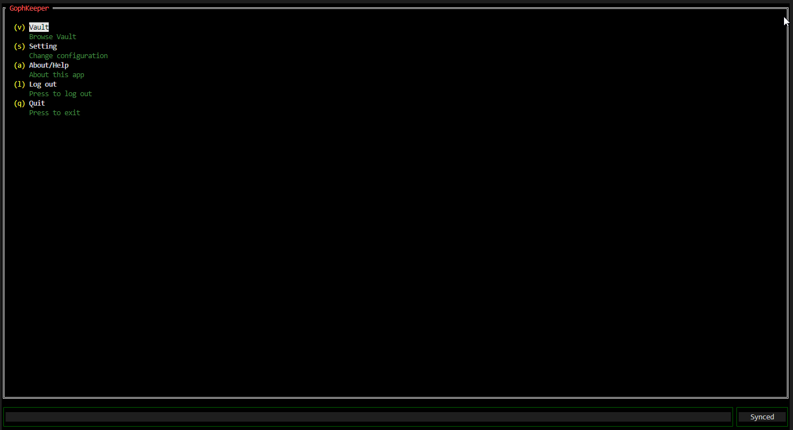

# GophKeeper

## About

GophKeeper is private data management client-server solution.

It was developed as graduation diploma of [Yandex Practicum's "Advanced Go-Developer" course.](https://practicum.yandex.ru/go-advanced/)

## Features:

- Four types of secret items for storing private data - Login, Card, Note, Data
- No pre-requirements for client
- Graphical terminal user interface (GTUI) for Windows, MacOS, Linux
- Two-factor authentication
- Server-client TLS authentication and encryption 
- Generation TOTP Verification codes
- Both client and server side encryption
- Server horizontal scaling

### Secret Items

1) Login - personal login information (username, password, authenticator key)
2) Card - credit card information (number, cardholder, month and year expiration, cvv)
3) Note - text information
4) Data - binary files

All items have notes field which may be used for storing related information.

All items may have custom fields for storing additional information:
- Text - key-value in plain text
- Hidden - same as text, but value is considered as sensitive information
- Bool - flag

Login items may have URI fields for storing related web-pages information.

Detailed description of items field is provided on DB schema below.

### Data Safety

Connections between client and server is secured by server-side TLS. All data is encrypted, only server needs to provide its certificate to client.

All private data (items), such as notes, secret's information, custom fields and URIs store encrypted with AES256-GCM in server's database. Data is encrypted by user's personal encryption key, which also stores encrypted in server's database. Encryption key in turn encrypted with user's secret key. This secret key is used only on client and is stored in client's config.

In general, to access private data client after successful login receives encryption key from server, decrypts this key with it's own secret key, then client is able to decrypt private data with encryption key.

User login process described in following figure:


Processes with items described in following figure:


## Client

Client is a ready-to-use terminal application, provided graphical user interface for interacting with server.
Graphical interface support keyboard and mouse control.

Client's configuration parameters:
- Username
- Server address
- Secret key
- E-mail
- Working mode
- Show sensitive (when enabled all item's value is shown by default, when disabled sensitive data is hidden)
- CA certificate path - path to custom CA root certificate in case server's certificate is signed by unknown authority of self-signed certificates used.

### Working mode
Client supports two working mode:
- Server
- Local

In server mode secret items is stored only on server, all operations with operations require server response. In case of server failure client will lose access to all operations to item, including reading.

In local mode secret items also stored locally (also encrypted). Reading secret items available in case of server failure. This allows reduce traffic between client and server.

However, for security purposes client will have no access to locally encrypted items without encryption key from server. Thus initial login is required to gain access to private data.

### Installation
Pre-complied executable for Windows, Linux and MacOS are available on [Releases page](https://github.com/artfuldog/gophkeeper/releases). No additional software required.

### Basic processes

**First time setup and user registration process:**


**Main menu:**



**Vault browse:**


**Edit items:**


**Autonomous work**


## Server

Server provides gRPC-API for users and items operations. For data store server uses external database.

Several server instances can be launched for distribute workload. In such cases all instances should use same server password, which used for generation AuthTokens.

### Database

Database driver is based on pgx4 package, so supported database type - PostgresSQL 10 and higher.

General DB Schema:


### AuthTokens and TLS authentication/encryption.

Currently server supports PASETO tokens for authentication and authorization user's request. Token expiration period is configurable parameter (by default equals 1800 seconds).

For TLS valid certificate and key should be passed via flags or envvars. For testing purposes TLS can be disabled. Also you can generate self-signed with `make cert` command

### Configuration parameters

Server's configuration parameters is described in documentation and can be viewed by `--help` option.

Parameters can be passed via environmental variables and cli arguments (flags). However, general recommendation is pass credentials **only** via envvars.

## **Roadmap, currently not implemented**
- Custom fields and URIs (for Login items) support in GUI
- Reprompt password to show sensitive information for flagged items
- Client local working mode, with storing data encrypted locally

## Documentation

Packages documentation is available in godoc format.

To run godoc server:

```
go install -v golang.org/x/tools/cmd/godoc@latest
godoc -http=:6060
```

Then open in browser - http://localhost:6060/pkg/github.com/artfuldog/gophkeeper/?m=all

## Development
All repo can be launched in MS VScode devcontainer.

Some of useful commands, such as generate proto-files, mocks, perform test and run client/server, provided in Makefile. To view it run `make help`.